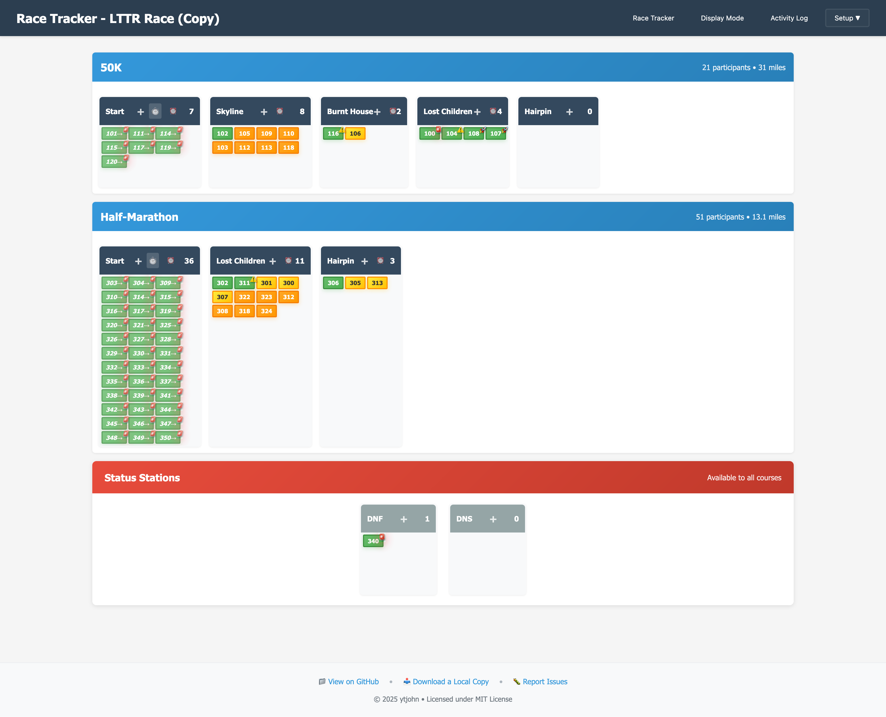

# Race Tracker

**Offline-first, browser-based race tracking system for amateur radio operators supporting trail races.**



## Overview

Race Tracker is a specialized tool designed for amateur radio operators who provide communication support for trail races. When runners are spread across remote areas with limited cell coverage, radio operators at aid stations relay position updates to net control. This application replaces paper-based tracking systems with an intuitive digital kanban board that works completely offline.

**Key Features:**
- 🏃‍♂️ **Multi-course support** with swimlane layout
- 📱 **Offline-first** - works without internet connection
- 🎯 **Batch entry** for quick participant updates with intelligent autocomplete
- 📊 **Activity logging** with timestamps and distance tracking
- 🖱️ **Drag-and-drop** interface for individual moves
- 💾 **Browser storage** - no server required
- 📺 **Display Mode** with live updates for public viewing screens
- 🔄 **Real-time data** with auto-refresh and live notifications
- ⏰ **Pace tracking** with ETA calculations and visual indicators
- 🎨 **Smart visual coding** - colors show ETA proximity, icons show pace performance

## Screenshots

See the [Screenshots Guide](docs/screenshots.md) for detailed visual documentation of all features and interfaces.

## Quick Start

### Download and Setup

1. **Download the project:**
   - Go to [https://github.com/ytjohn/race-tracker](https://github.com/ytjohn/race-tracker)
   - Click the green "Code" button → "Download ZIP"
   - Extract the ZIP file to your computer

2. **Launch the application:**
   - Navigate to the extracted folder
   - Open `src/index.html` in any modern web browser
   - The application will load with sample data

3. **Set up your event:**
   - Follow the setup workflow: Event → Aid Stations → Courses → Participants
   - Or modify the sample data to match your race

That's it! No installation, no server setup, no internet connection required.

## Event Setup Guide

### 1. Event Setup
Configure basic event information:
- **Event Name:** "Lost Turkey Trail Race 2024"
- **Date:** Race date
- **Location:** Race location
- **Description:** Optional event details

### 2. Aid Stations Setup
Define all aid stations for your race:
- **Default stations:** Start, Finish, DNF, DNS are included automatically
- **Custom stations:** Add your specific aid stations (e.g., "Burnt House", "Lost Children", "Hairpin")
- **Station names** should match what radio operators will use

### 3. Courses Setup
Create courses and define aid station sequences:
- **Course Name:** "50K", "Half Marathon", etc.
- **Aid Station Sequence:** Select stations in the order runners will encounter them
- **Distances:** Enter distances between stations (optional but recommended)
- **Multiple courses** can share the same aid stations

**Example 50K Course:**
```
Start → Skyline (8.6 mi) → Burnt House (8.3 mi) → Lost Children (6.6 mi) → Hairpin (3.5 mi) → Finish (4.0 mi)
```

**Example Half Marathon:**
```
Start → Lost Children (5.7 mi) → Hairpin (3.5 mi) → Finish (4.0 mi)
```

### 4. Participants Setup
Add participants and assign them to courses:
- **Individual Entry:** Add participants one by one with ID, name, and course
- **Bulk Entry:** Paste comma-separated participant IDs
- **Course Assignment:** Each participant must be assigned to a specific course
- **Special Participants:** Add sweeps, crew, and other non-race participants

**Participant Types:**
- **Race participants:** Runners with bib numbers (e.g., "101", "102")
- **Other participants:** Sweeps, crew, volunteers (e.g., "50K Sweep", "Medical")

## Race Day Operations

### Race Tracker Interface
The main race tracking interface shows:
- **Course Swimlanes:** Each course gets its own horizontal section
- **Aid Station Columns:** Stations appear in course order
- **Participant Cards:** Show current location and course assignment
- **Status Stations:** DNF/DNS available to all courses

### Batch Entry
Click any station header to open batch entry:
- **Participants:** Enter comma-separated list (supports autocomplete)
- **Time:** Flexible format - "10:05", "1005", "2PM", "14:30"
- **Notes:** Optional message or details
- **Course Analysis:** Real-time validation with color-coded feedback

**Batch Entry Examples:**
```
Participants: 101, 102, 103, 50K Sweep
Time: 10:15
Notes: All runners looking good, requesting water resupply
```

### Drag and Drop
- Drag individual participant cards between stations
- Useful for single participant updates
- Maintains activity log automatically

### Pace Tracking & ETA System
Advanced pace analysis provides actionable intelligence for race volunteers:
- **ETA-Based Sorting**: Participants sorted by soonest arrival time (not fastest pace)
- **Visual Color Coding**: 🟢 Green (arriving <10 min), 🟡 Yellow (10-30 min), 🟠 Orange (30+ min)
- **Pace Performance Icons**: 🚀 Ahead of pace, ⚠️ Behind pace, 🚨 Significantly overdue
- **Intelligent Predictions**: Uses participant's own pace history for personalized ETAs
- **Course Distance Integration**: Calculates accurate pace and ETA using configured station distances
- **Hover Tooltips**: Detailed pace information, ETA predictions, and confidence levels

### Activity Log
View comprehensive race activity:
- **Chronological listing** of all movements and messages
- **Distance calculations** based on course setup
- **Course analysis** showing progression validation
- **Export-ready format** for race officials

### Display Mode
Specialized interface for public viewing screens:
- **Live Activity Ticker:** Scrolling banner with detailed participant movements
- **Enhanced Live Updates:** Vertical layout for multiple activities with specific details
- **Pace-Based Visual System:** Same ETA colors and pace icons as race tracker
- **Activity-Based Sorting:** Most recent activity first (optimized for spectator engagement)
- **Built-in Legend:** Shows ETA colors and pace icons for easy interpretation
- **Auto-Refresh:** Updates every 2 seconds with live data polling
- **Three Display Views:**
  - **Board View:** Compact train-schedule layout showing all stations
  - **Courses View:** Detailed progression stats per course and station
  - **Statistics View:** High-level race metrics and totals
- **Auto-Rotation:** Cycles between views every 30 seconds
- **Manual Navigation:** Click view buttons to switch immediately
- **Fullscreen Support:** Dedicated fullscreen mode with hidden navigation
- **Live Updates:** Red notification banners when new data arrives
- **No User Interaction:** Perfect for passive spectator viewing

## Use Cases

### Typical Race Day Workflow

1. **Pre-race Setup:**
   - Configure event, stations, courses, and participants
   - Set up Display Mode on TV/monitor for public viewing
   - Test with radio operators and verify live updates

2. **During Race:**
   - Radio operators report: "Net control, Hairpin station, runners 101, 102, 103 arrived at 10:15"
   - Operator enters batch update via station header click
   - Intelligent autocomplete prioritizes valid moves for faster entry
   - Participants automatically move from previous station to current
   - Activity log captures all movements with timestamps
   - Pace tracking system calculates ETAs and updates visual indicators

3. **Race Monitoring:**
   - Race tracker shows participants sorted by soonest arrival ETA
   - Visual color coding helps volunteers prioritize attention (green = arriving soon)
   - Pace performance icons identify participants who may need extra support
   - Spectators view live progress on Display Mode screens with pace-based visual system
   - Auto-rotating views show board, course stats, and race metrics
   - Course analysis helps identify issues (wrong course, missed stations)
   - Activity log provides official record for race coordinators

4. **Post-race:**
   - Activity log serves as complete race record
   - Data remains in browser for future reference
   - Export capabilities for race officials (future enhancement)

### Multi-Course Races
Perfect for events with multiple distances using shared aid stations:
- **50K and Half Marathon** using same finish area
- **Different start times** with overlapping courses  
- **Separate swimlanes** prevent confusion between courses
- **Shared status stations** (DNF/DNS) for all courses

## Technical Details

### Browser Compatibility
- **Modern browsers:** Chrome, Firefox, Safari, Edge
- **No plugins required:** Pure HTML, CSS, and JavaScript
- **Mobile friendly:** Works on tablets and phones
- **Offline capable:** No internet connection needed

### Data Storage
- **LocalStorage:** All data stored in browser
- **Automatic saving:** Changes saved immediately
- **No server required:** Completely self-contained
- **Data persistence:** Survives browser restarts

### Architecture
- **Modular design:** Separate JavaScript files for each feature
- **Event-driven:** Real-time updates across all components
- **State management:** Centralized data with automatic persistence
- **Responsive UI:** Adapts to different screen sizes

## Advanced Features

### Event Management
- **Multiple events:** Switch between different races
- **Event duplication:** Copy setup for similar races
- **Default templates:** Start with pre-configured data
- **Event switching:** Maintain separate data for each race

### Course Analysis
Real-time validation during batch entry:
- **✅ Blue checkmark:** Valid course progression
- **⚠️ Yellow warning:** Out of order or skipped stations
- **❌ Red error:** Wrong course or invalid movement

### Participant Management
- **Course reassignment:** Move participants between courses
- **Participant removal:** Handle DNS/DNF situations
- **Auto-creation:** New participants added automatically during entry
- **Visual grouping:** Participants organized by course assignment

## Support and Development

### Project Status
This project is **race-day ready** with all core features implemented and tested. It successfully replaces paper-based tracking systems with a modern, efficient digital solution.

### Contributing
- **GitHub:** [https://github.com/ytjohn/race-tracker](https://github.com/ytjohn/race-tracker)
- **Issues:** Report bugs or request features
- **Pull requests:** Contributions welcome

### License
Open source project - see repository for license details.

---

## Background

This application was developed for the amateur radio operators who support the Lost Turkey Trail Race and similar events. It replaces a modified version of nullboard (kanban board) that required manual drag-and-drop for every participant movement. The new system maintains the visual kanban interface while adding batch entry capabilities, multi-course support, and comprehensive activity logging.

**Times are estimates only.** Runners are often reported in 5-15 minute batches. Official timing is handled by race organizers at start/finish lines. This system provides general progress tracking for participants, supporters, and race coordination.

---

*Ready to track your next trail race? Download, open `src/index.html`, and get started!*

