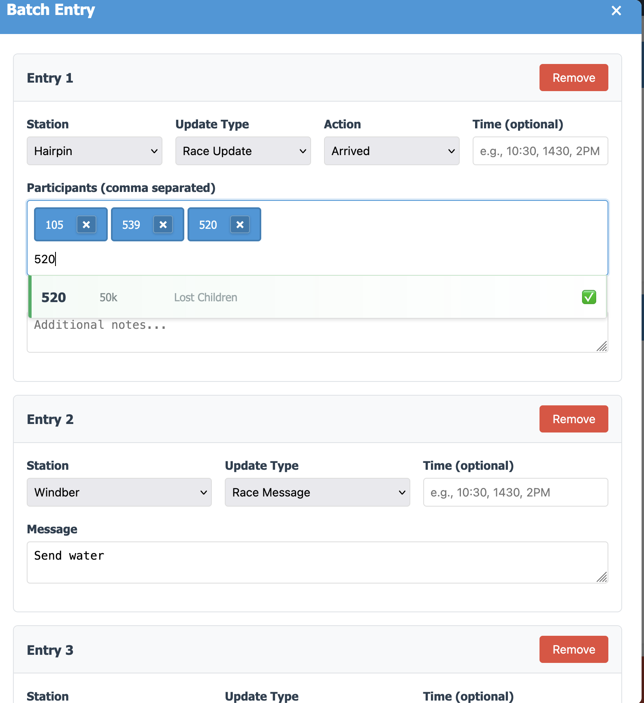
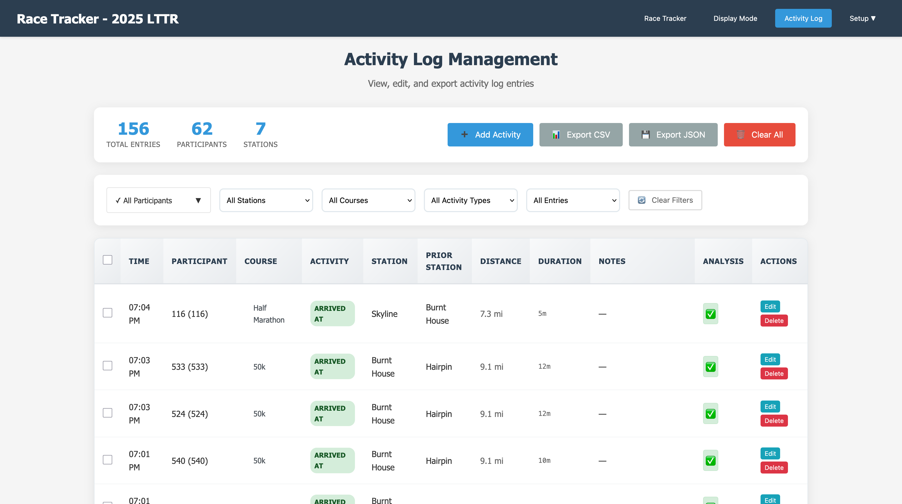
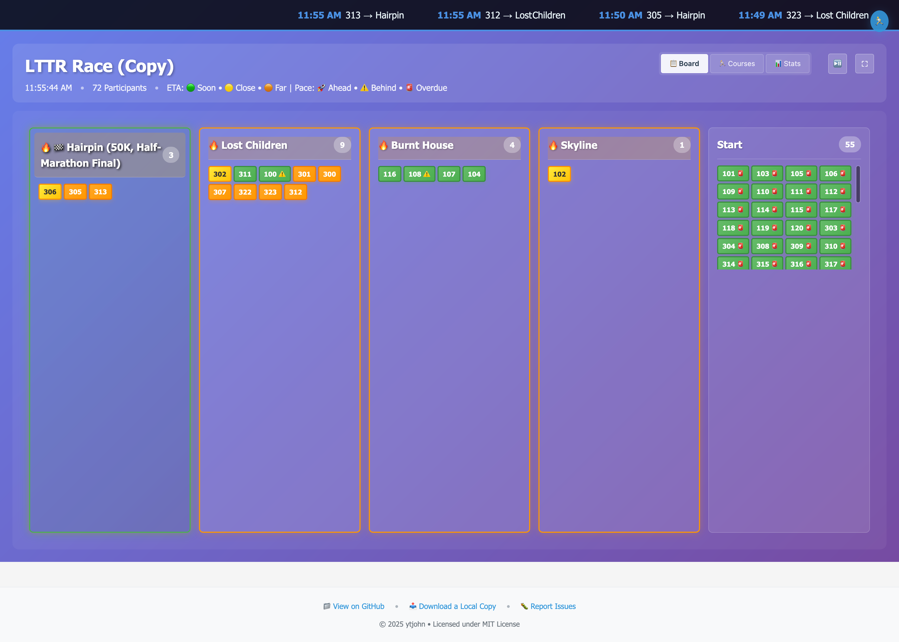
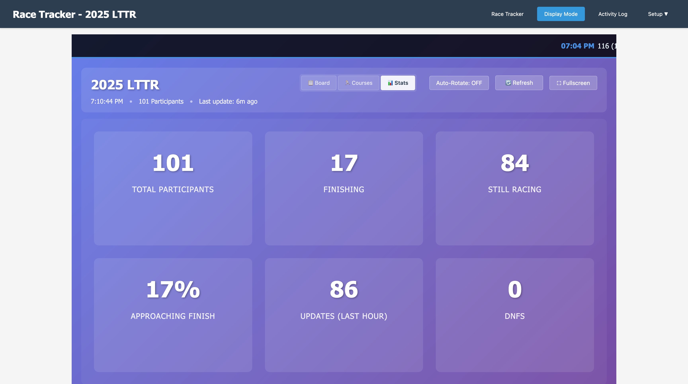

# Race Tracker Screenshots

This page showcases the key features and interfaces of the Race Tracker application through detailed screenshots.

## Main Race Tracker Interface

**Main Race Tracking Interface** - The heart of the application showing:
- **Course Swimlanes**: Separate horizontal sections for each race course (50K, Half Marathon)
- **Aid Station Columns**: Stations arranged in course order with participant counts
- **Participant Cards**: Individual runners displayed with bib numbers and course colors
- **Drag & Drop**: Move individual participants between stations
- **Station Headers**: Click any station header to open batch entry modal
- **Recent Activity**: Golden highlighting shows participants with recent updates
- **Final Station Indicators**: Green glow and 🏁 emoji mark course finish points

The interface provides an at-a-glance view of race progress with all participants organized by their current location and course assignment.

## Batch Entry System

**Batch Entry Modal** - Efficient bulk participant updates featuring:
- **Participant Input**: Comma-separated list with autocomplete suggestions
- **Time Entry**: Flexible time formats (10:15, 1015, 2PM, 14:30)
- **Course Analysis**: Real-time validation with color-coded feedback
  - ✅ **Blue checkmark**: Valid course progression
  - ⚠️ **Yellow warning**: Out of order or skipped stations  
  - ❌ **Red error**: Wrong course or invalid movement
- **Notes Field**: Optional messages and details
- **Preview Mode**: Review all entries before submission

This system allows radio operators to quickly process multiple participant updates from station reports like "Hairpin station, runners 101, 102, 103 arrived at 10:15".

## Activity Log Management

**Activity Log Interface** - Comprehensive race activity tracking with:
- **Chronological Listing**: All movements and messages sorted by time
- **Participant Filtering**: Filter by specific participants or stations
- **Activity Types**: Arrivals, departures, messages, and status changes
- **Course Analysis**: Visual indicators showing progression validation
- **Distance Tracking**: Calculated distances based on course configuration
- **Duration Calculations**: Time between participant movements
- **Edit Capabilities**: Modify entries with inline editing
- **Export Ready**: Complete race record for officials

The activity log serves as the official record of all race activities and provides detailed analytics for race coordination.

## Display Mode - Board View

**Display Mode Board View** - Optimized for public viewing featuring:
- **Compact Layout**: Train-schedule style display showing all stations without scrolling
- **Live Activity Ticker**: Scrolling banner at top with recent participant movements
- **Auto-Refresh**: Updates every 2 seconds with live data polling
- **Recent Highlights**: Golden glow for participants with updates in last 5 minutes
- **Final Station Indicators**: Special styling for course endpoints
- **Station Activity**: 🔥 emoji and orange glow for stations with recent activity (30 minutes)
- **Auto-Rotation**: Cycles between Board, Courses, and Stats views every 30 seconds
- **Fullscreen Support**: ⛶ button for full-screen display mode

Perfect for public monitors where spectators can track race progress passively.

## Display Mode - Statistics View

**Display Mode Statistics View** - High-level race metrics including:
- **Total Participants**: Overall race participation numbers
- **Active Participants**: Currently racing (not DNS/DNF)
- **Course Breakdown**: Participants by course with percentages
- **Approaching Finish**: Participants at their course's final aid station
- **Status Tracking**: DNF, DNS, and suspect data counts
- **Live Updates**: Real-time statistics with auto-refresh
- **Large Format**: Optimized for viewing from a distance

Provides race directors and spectators with key race metrics at a glance.

## Display Mode - Courses View

**Display Mode Courses View** - Detailed course progression analysis featuring:
- **Course-by-Course Breakdown**: Separate section for each race course
- **Station Statistics**: Four key metrics per active station:
  - **Count**: Number of participants currently at station
  - **Percentage**: What percentage of course participants are there
  - **First Arrival**: Time when first participant reached the station
  - **Last Update**: Time since most recent activity
- **Final Station Highlighting**: Green border and glow effects for course endpoints
- **Empty Station Filtering**: Only shows stations with participants (count > 0)
- **Horizontal Grid Layout**: Efficient use of screen space
- **Course Totals**: Total participant count per course in header

This view provides race operations teams with detailed insights into course progression, timing, and participant distribution across all aid stations.

## Key Features Demonstrated

### Multi-Course Support
All screenshots show the system handling multiple race courses (50K and Half Marathon) simultaneously with:
- Separate participant tracking per course
- Shared aid stations with course-specific routing
- Visual distinction through color coding and swimlanes

### Real-Time Updates
The display modes showcase live data capabilities:
- 2-second data refresh cycles
- Live update notifications with red sliding banners
- Automatic ticker restarts when new data arrives
- Golden highlighting for recent participant movements

### Operational Efficiency
The interface design prioritizes race-day efficiency:
- Batch entry for processing radio reports quickly
- Drag-and-drop for individual participant adjustments
- Course analysis preventing data entry errors
- Comprehensive activity logging for race records

### Public Display Features
Display mode optimizations for spectator viewing:
- Large, readable text and numbers
- Auto-rotation between different views
- Fullscreen support for dedicated monitors
- Passive viewing with no user interaction required

---

These screenshots demonstrate how Race Tracker transforms amateur radio race support from paper-based tracking to a modern, efficient digital system while maintaining the visual clarity and operational workflow that race coordinators need.
