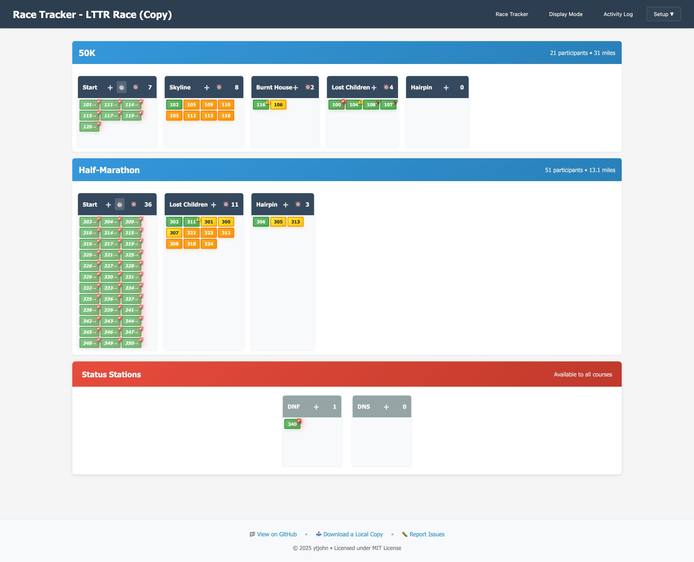
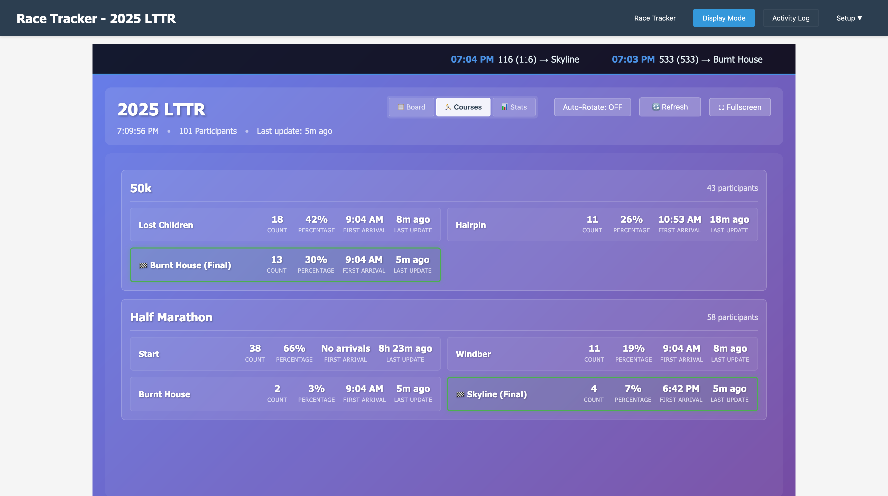

# Race Tracker Screenshots

This page showcases the key features and interfaces of the Race Tracker application through detailed screenshots.

## Main Race Tracker Interface

**Main Race Tracking Interface** - The heart of the application showing:
- **Course Swimlanes**: Separate horizontal sections for each race course (50K, Half Marathon)
- **Aid Station Columns**: Stations arranged in course order with participant counts and ETA sorting indicators (⏰)
- **Participant Cards**: Individual runners with intelligent pace-based visual coding:
  - **ETA Colors**: 🟢 Green (arriving <10 min), 🟡 Yellow (10-30 min), 🟠 Orange (30+ min)
  - **Pace Icons**: 🚀 Ahead of pace, ⚠️ Behind pace, 🚨 Significantly overdue
  - **ETA Sorting**: Participants sorted by soonest arrival time (not fastest pace)
- **Drag & Drop**: Move individual participants between stations
- **Station Headers**: Click any station header to open batch entry modal
- **Pace Legend**: Toggle button (visible only on race tracker) shows pace coding reference
- **Final Station Indicators**: Green glow and 🏁 emoji mark course finish points

The interface provides race volunteers with actionable intelligence - who needs attention first (green at top), who's coming soon (yellow), and who's still far out (orange). The pace performance icons help identify participants who may need extra attention without casting negative judgment.

## Batch Entry System

**Batch Entry Modal** - Efficient bulk participant updates featuring:
- **Participant Input**: Comma-separated list with intelligent autocomplete
  - **Smart Prioritization**: Valid moves appear first, invalid moves at bottom
  - **Match Quality Sorting**: Exact matches, then "starts with", then contains
  - **Validity Indicators**: Green checkmarks for valid moves, warnings for invalid
- **Time Entry**: Flexible time formats (10:15, 1015, 2PM, 14:30)
- **Course Analysis**: Real-time validation with color-coded feedback
  - ✅ **Blue checkmark**: Valid course progression
  - ⚠️ **Yellow warning**: Out of order or skipped stations  
  - ❌ **Red error**: Wrong course or invalid movement
- **Notes Field**: Optional messages and details
- **Preview Mode**: Review all entries before submission

This system allows radio operators to quickly process multiple participant updates from station reports like "Hairpin station, runners 101, 102, 103 arrived at 10:15". The intelligent autocomplete ensures valid participants appear first, making data entry faster and more accurate.

## Activity Log Management

**Activity Log Interface** - Comprehensive race activity tracking with:
- **Chronological Listing**: All movements and messages sorted by time
- **Participant Filtering**: Filter by specific participants or stations
- **Activity Types**: Arrivals, departures, messages, and status changes
- **Course Analysis**: Visual indicators showing progression validation
- **Distance Tracking**: Calculated distances based on course configuration
- **Duration Calculations**: Time between participant movements
- **Edit Capabilities**: Modify entries with inline editing
- **Export Ready**: Complete race record for officials

The activity log serves as the official record of all race activities and provides detailed analytics for race coordination.

## Display Mode - Board View

**Display Mode Board View** - Optimized for public viewing featuring:
- **Compact Layout**: Train-schedule style display showing all stations without scrolling
- **Live Activity Ticker**: Scrolling banner with detailed participant movements
- **Enhanced Live Updates**: Vertical layout for multiple activities with specific details
- **Pace-Based Visual Coding**: Same ETA colors and pace icons as race tracker
- **Activity-Based Sorting**: Most recent activity appears first (different from race tracker's ETA sorting)
- **Auto-Refresh**: Updates every 2 seconds with live data polling
- **Pace Legend**: Built-in legend showing ETA colors and pace icons
- **Station Activity**: 🔥 emoji and orange glow for stations with recent activity (30 minutes)
- **Auto-Rotation**: Cycles between Board, Courses, and Stats views every 30 seconds
- **Fullscreen Support**: ⛶ button for full-screen display with hidden navigation

Perfect for public monitors where spectators can track race progress passively. The pace-based visual system helps spectators understand participant status at a glance.

## Display Mode - Statistics View

**Display Mode Statistics View** - High-level race metrics including:
- **Total Participants**: Overall race participation numbers
- **Active Participants**: Currently racing (not DNS/DNF)
- **Course Breakdown**: Participants by course with percentages
- **Approaching Finish**: Participants at their course's final aid station
- **Status Tracking**: DNF, DNS, and suspect data counts
- **Live Updates**: Real-time statistics with auto-refresh
- **Large Format**: Optimized for viewing from a distance

Provides race directors and spectators with key race metrics at a glance.

## Display Mode - Courses View

**Display Mode Courses View** - Detailed course progression analysis featuring:
- **Course-by-Course Breakdown**: Separate section for each race course
- **Station Statistics**: Four key metrics per active station:
  - **Count**: Number of participants currently at station
  - **Percentage**: What percentage of course participants are there
  - **First Arrival**: Time when first participant reached the station
  - **Last Update**: Time since most recent activity
- **Final Station Highlighting**: Green border and glow effects for course endpoints
- **Empty Station Filtering**: Only shows stations with participants (count > 0)
- **Horizontal Grid Layout**: Efficient use of screen space
- **Course Totals**: Total participant count per course in header

This view provides race operations teams with detailed insights into course progression, timing, and participant distribution across all aid stations.

## Key Features Demonstrated

### Multi-Course Support
All screenshots show the system handling multiple race courses (50K and Half Marathon) simultaneously with:
- Separate participant tracking per course
- Shared aid stations with course-specific routing
- Visual distinction through color coding and swimlanes

### Real-Time Updates
The display modes showcase live data capabilities:
- 2-second data refresh cycles
- Live update notifications with red sliding banners
- Automatic ticker restarts when new data arrives
- Golden highlighting for recent participant movements

### Operational Efficiency
The interface design prioritizes race-day efficiency:
- Batch entry for processing radio reports quickly
- Drag-and-drop for individual participant adjustments
- Course analysis preventing data entry errors
- Comprehensive activity logging for race records

### Public Display Features
Display mode optimizations for spectator viewing:
- Large, readable text and numbers
- Auto-rotation between different views
- Fullscreen support for dedicated monitors
- Passive viewing with no user interaction required

---

These screenshots demonstrate how Race Tracker transforms amateur radio race support from paper-based tracking to a modern, efficient digital system while maintaining the visual clarity and operational workflow that race coordinators need.
